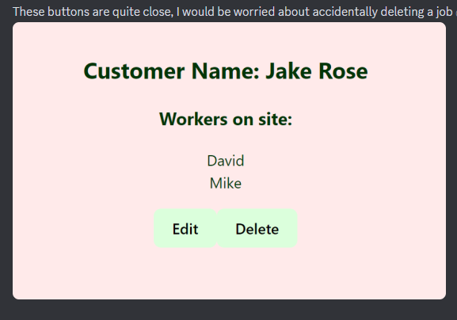
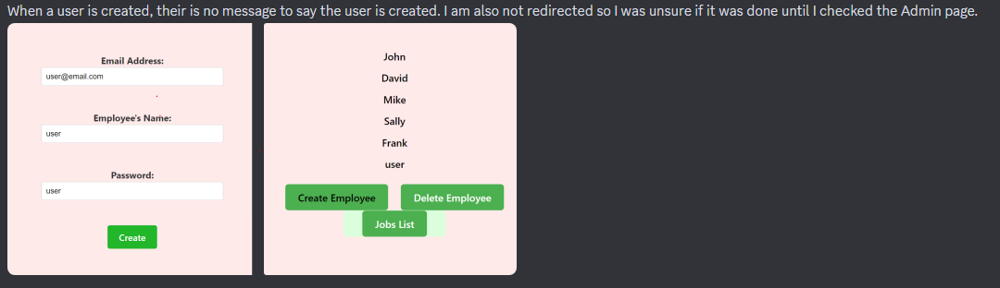
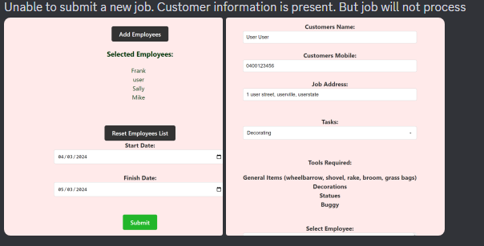
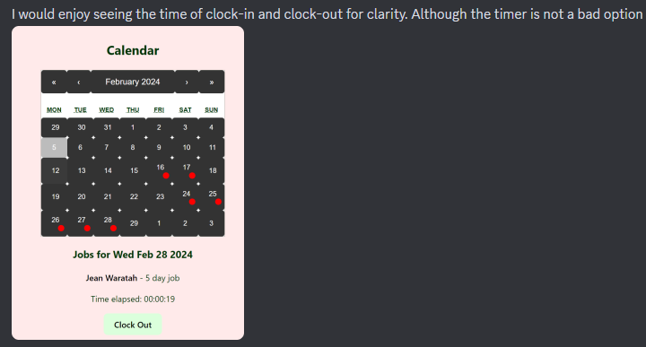
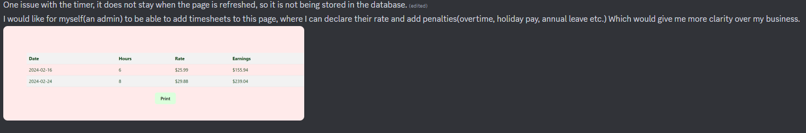

## T3A2-A - Full Stack App (Part B)

## Landscaping Business Scheduling and Operation Platform - Green Thumb
### Harry, Connor and Adam.

#### **README Contents:**
1. [Deployed Site Link](#Deployed-Site-Link)  
1. [Repository Links](#Repository-Links)  
1. [Part A Link](#Part-A)
1. [User Testing](#User-Testing)  
1. [Project Management](#Project-Management)

### Deployed Site Link
- Front End - UI
[Greenthumb-Front End Repo](https://main--profound-cobbler-e9917b.netlify.app/)

Please use john@email.com for manager access / pw : john
Please use sally@email.com for employee access / pw : sally

- Back End - (API)
[Greenthumb-Back End Repo](https://greenthumb-backend.onrender.com/)

### Repository Links
- Front End
[Greenthumb-Front End Repo](https://github.com/gthumbcah/GreenThumb-Frontend)
- Back End
[Greenthumb-Back End Repo](https://github.com/gthumbcah/GreenThumb-Backend)
### Part A
[Greenthumb Part-A readme.MD](https://github.com/huttadam/GreenThumb-PartA/blob/main/README.md)

### Project Management

#### Trello Link - Completed
[Greenthumb Production Trello Board](https://trello.com/b/kKpNEn4u/t3-full-stack-mern-application)

#### Screenshots
More comprehensive evidence in docs file.
##### Part A

##### Part B

### User Testing
Below are some examples of user testing completed on the applciation of GreenThumb.

